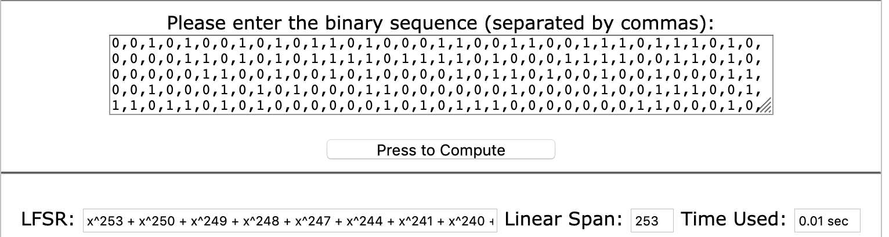

Baby LFSR
==============

In this challenge we are given a Python script implementing a LFSR and the first 504 bits of output.

The flag we are looking for is the SHA256 of the initial state (in hex form).
We also know that this hash starts with `1224` (which might suggests there are multiple seed/polynomial).
We do not know the taps of the LFSR but we know the polynomial is of degree 256.

```python
assert(FLAG=="de1ctf{"+hashlib.sha256(hex(KEY)[2:].rstrip('L')).hexdigest()+"}")
assert(FLAG[7:11]=='1224')

LENGTH = 256

assert(KEY.bit_length()==LENGTH)
assert(MASK.bit_length()==LENGTH)
```

The first step is to recover the taps of the LFSR. We can use [this site](http://bma.bozhu.me/), which uses Berkelamp Massey to find the polynomial associated with an output.


As you can see in the picture, the degree of the polynomial is only 253. According to [this paper](https://www.rocq.inria.fr/secret/Anne.Canteaut/MPRI/chapter3.pdf):
```Thus, the Berlekamp-Massey algorithm determines the shortest LFSR thatgenerates an infinite linear recurring sequences from the knowledge of any 2Λ(s) consecutive digits of s```

Where Λ(s) is the degree (256 here).
So we need to append 8 bits to the output to recover the original mask.

As expected, we find multiple masks. For each mask, we invert the LFSR to recover the initial seed and check if its hash starts with `1224`.

Since the output of the LFSR is added to the state (see [this](https://en.wikipedia.org/wiki/Linear-feedback_shift_register#/media/File:LFSR-F16.svg)), with the 256 first bits of output, we can recover the state at time t=256.
From there we run the LFSR backwards: we have the output bit and all bits in the state (except from the MSB) and we compute the MSB.
Using the example above, we have:
* Going forward: bit_16 ^ bit_14 ^ bit_13 ^ bit_11 = output_bit
* Going backwards: bit_16 = bit_14 ^ bit_13 ^ bit_11 ^ output_bit

Running the [attached script](solve.py), we get the flag: `de1ctf{1224473d5e349dbf2946353444d727d8fa91da3275ed3ac0dedeb7e6a9ad8619}`
