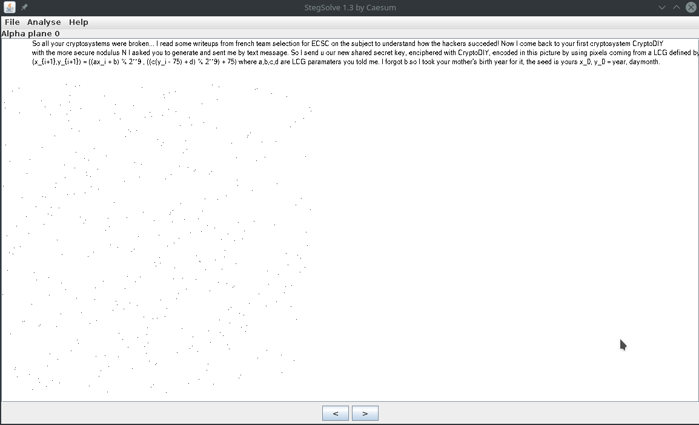
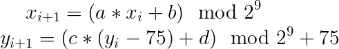
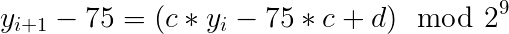

# L'image du Hack

Allez c'est parti pour un write-up deux en un.


Nous avions à notre disposition cette magnifique image de la cité de la science à Paris à notre disposition pour 2 challenges différents :
- Un forensic de 50 pts (facile)
- Un crypto de 200 pts (difficile)

## Le forensic

Très simple ici, il suffit de faire un cat ou un strings sur l'image pour voir apparaître une grande chaine encodée en base64 :

```
$ strings leHACK19_chall.png
@duMBTiA9IDExNzU1MDY4OTQ0MTQyOTY5NDk4NzQzMjQ1OTg0NzYxMTgxMzI1NjA1MzA0NjI1Mjg2OTU4NzIxMzkxNzY2MDkxMjgzMTMyMzk4NDM3NjQ1MDM4MzQ5Nzc1ODk4OTIzNDY1MzMxMjYwMzA4MDY0NjExMTY3OTI2MTg3Mzk5Mzg0NzIzMzYwOTQxODgzNzMyMTc0OTAxNjY2ODAzICxnMSA9IDM4MDg4MTk1MDU1NjQ5OTk1NDUyNTI2MjM2MzExOTI1MDMyMTIxODY1OTgwODg1NTUzNDM3MzgxMTExNjUzODI2MjM0MjE3MjAxMTk4Mzc1NDQ2NTgxNzM4MjI0NjE4MzQwNzYzNDc3OTUxNTkzNjY1OTMxNzc2NjkwNTg3MDUwODcyNjY4OTg0NDQ4MTg5MjY2Njg1ODQ1MTksIGcyID0gODcyMTc4NzQwMDMyNzc4Mzc0ODAxNDg0OTAzNzYyNjAzOTM5NzgwNzYxMjM3MjgwNDAxNjY0MzY1MzA0NzU3NTk3NjAwOTgyNzAwMzQ0Nzc3ODg2MTI2MjAzNjc1MjMyNjgyNzYxMzA3ODM0NjIyNTE5MjU4MTcwODI0MDgyMDMyNTg2NzY1ODc0MjA3ODY5NDQ0NTY3Nzg3NyBJIHVzZSB0aGlzIGZ1bmN0b25zIGZvciBlbmNpcGhlcmluZyBvdXIgc2tleSA6IGVuY2lwaGVyKGludC5mcm9tX2J5dGVzKHNrZXksJ2JpZycpLGcxLGcyLE4pIHdpdGggZGVmIGVuY2lwaGVyKG0sZzEsZzIsTik6IHMxPXJhbmRvbS5yYW5kcmFuZ2UoMioqMTI3LDIqKjEyOCkgczI9cmFuZG9tLnJhbmRyYW5nZSgyKioxMjcsMioqMTI4KSByZXR1cm4gKG0qcG93KGcxLHMxLE4pKSVOLCAobSpwb3coZzIsczIsTikpJU4gYW5kIGhlcmUgaXMgYSBmbGFnOiBsZWhhY2syMDE5e2FlZjk1NTZhNTc1Y2M5ZGU4ZmM5NjA5YmQwMzRkNjNmZTBhMDE0NzBlYjQwMTM3ODI1M2Y3MjNiYmM1Y2MxNmN9

$ echo "@du...NmN9" | base64 -di
v�N = 11755068944142969498743245984761181325605304625286958721391766091283132398437645038349775898923465331260308064611167926187399384723360941883732174901666803 ,g1 = 3808819505564999545252623631192503212186598088555343738111165382623421720119837544658173822461834076347795159366593177669058705087266898444818926668584519, g2 = 8721787400327783748014849037626039397807612372804016643653047575976009827003447778861262036752326827613078346225192581708240820325867658742078694445677877 I use this functons for enciphering our skey : encipher(int.from_bytes(skey,'big'),g1,g2,N) with def encipher(m,g1,g2,N): s1=random.randrange(2**127,2**128) s2=random.randrange(2**127,2**128) return (m*pow(g1,s1,N))%N, (m*pow(g2,s2,N))%N and here is a flag: lehack2019{aef9556a575cc9de8fc9609bd034d63fe0a01470eb401378253f723bbc5cc16c}%
```

Et voilà le premier flag : lehack2019{aef9556a575cc9de8fc9609bd034d63fe0a01470eb401378253f723bbc5cc16c}

Le reste du texte était pour le crypto 3 des qualifications.

## La crypto

Pour cette partie, Titanex et moi l'avons résolu ensemble.

### La stéga

Nous avons donc une image à notre disposition. En nous basant sur la stegaDIY qui avait été donnée durant les préqualifications, nous nous doutions que toutes les informations étaient cachées dans l'image. Nous avons donc sorti stegsolve pour analyser l'image.

En examinant les "planes" (c'est à dire des filtres mis sur les bits des valeurs des octets représentant les couleurs R, G, B et l'alpha - la transparence -), nous obtenons l'image suivante avec le filtre sur le "alpha plane 0":



Nous avons donc le véritable challenge : 2 LCG (Linear Congruential Generator) à cracker pour récupérer le flag qui se cache dans les pixels de l'image du challenge qui sont aux coordonnées des pixels noirs de l'image trouvée avec stegsolve.

### Les mathématiques

En effet, nous avons 2 équations :
- x_{i+1} = (a * x_{i} +b) \mod 2^{9}
- y_{i+1} = (c * (y_{i}-75) +b) \mod 2^{9} + 75



Pour y, il est nécessaire de modifier l'équation de y pour avoir une véritable LCG de la forme a' * x + b' mod m.



Le 75 est un décalage. Il est possible de s'en rendre compte en regardant bien l'image obtenue avec stegsolve. En effet, aucun point du nuage de points ne possède un y inférieur à 75. Les concepteurs ont ajouté ce décalage pour éviter un overlap entre le nuage de point et le texte.

Il suffit donc de décaler ce nuage de point pour obtenir des valeurs comprises entre 0 et 512 (2 ** 9).

Pour la suite mathématique, nous avons trouvé un [write-up](https://github.com/smokeleeteveryday/CTF_WRITEUPS/blob/master/2015/VOLGACTF/crypto/lcg/README.md) d'un challenge du VOLGACTF de 2015 qui explique comment il est possible de retrouver les paramètres a, b et x_{0} d'un LCG.
Ce write-up indique qu'il est possible de retrouver nos inconnues si l'on possède 3 points consécutifs. Cela nous donne donc 3 équations modulaires à 3 inconnues.
Pour les résoudre, nous avons trouvé un [code sage](https://github.com/kelbyludwig/lcg/blob/master/lcg_modulus.sage) sur github qui le faisait. En fait, c'est très simple, car sage possède une méthode pour résoudre ce type d'équations : `solve_mod`. Il est aussi possible d'imaginer une solution purement python comme le write-up précédant.

```python
def recover_lcg_state(r1, r2, r3, modulus):
    """ Given 3 sequential outputs and a modulus from a LCG: recover the other
    unknowns. Specifically, this will recover the "seed", the multiplier, and
    the increment value. The "seed" is not necessarily, the number used to
    initialize the RNG, but the unknown state value used to create the first
    random number.

    Args:
      r1, r2, r3  (int): Three sequential pseudo-random integers output from an
      LCG PRNG.  
      m (int): The modulus used in the LCG PRNG.

    Returns:
      dict(str,int):  A dictionary containing the increment, multiple, and seed
      value with respective keys ("inc", "mult", "seed").
    """
    var('inc,mult,seed')
    eqns = [r1 == seed*mult + inc, r2 == r1*mult + inc, r3 == r2*mult + inc]
    return solve_mod(eqns=eqns, modulus=modulus, solution_dict=True)
```
 
Nous avons donc :
- 2 équations LCG
- 1 méthode pour retrouver les inconnues

Il nous manque donc les 3 points consécutifs. En reprenant l'énoncé, il nous était indiqué que le flag était de cette forme `lehack{...}`.

Il suffit donc de récupérer les x et y des pixels associés aux lettres : l, e, h.

### Les pixels

Les pixels qui nous intéressent sont noirs sur le "Alpha plane 0", le bit 0 de l'alpha est donc à 0, donc la valeur alpha de ces pixels est de 254.
On cherche tous les pixels qui ont cette caractéristique et on affiche pour les valeurs RGB la correspondance ASCII (cf [get_points.py](get_points.py)).

```bash
./get_points.py  | wc -l
     340
```

340 points ça fait beaucoup, surement beaucoup d'inutiles.
On cherche nos lettres "l", "e" et "h"
```bash
./get_points.py  | grep l
(53, 386, ['l', '\x08', '\x08'])
./get_points.py  | grep e
(6, 175, ['\x00', 'e', '\x00'])
(387, 196, ['\xff', '\xff', 'e'])
./get_points.py  | grep h
(375, 512, ['\xff', '\x00', 'h'])
```

On trouve un "l" dans une composante R, un "e" dans G et B, et un "h" dans B.
On peut supposer que les caractères sont tour à tour encodés dans la composante R, puis G, puis B.

On a donc nos 3 premiers points, on peut trouver les paramètres du LGD et reconstruire le flag

### La solution finale

La solution est implémentée dans [solve.sage](solve.sage). 
Elle cherche les 3 premiers points comme décrits au-dessus, résout les équations, extrait les valeurs de l'image et affiche le flag:

`lehack2019{Line4rGu3n4raTOR}`
