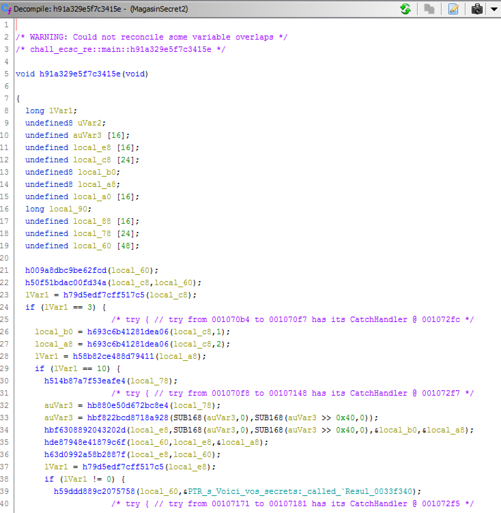
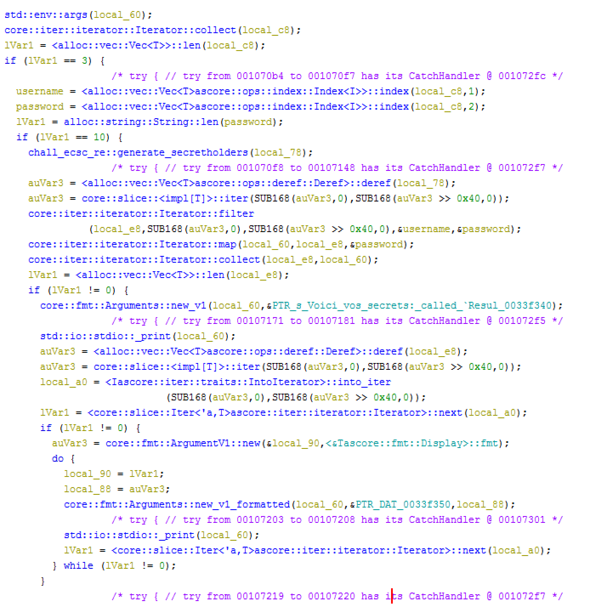
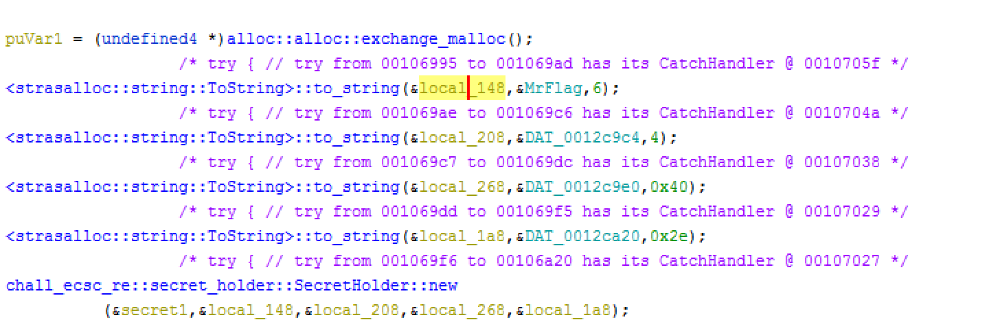

MagasinSecret
===========================

This challenge was the only reverse challenge at French ECSC finals.
The binary is a password manager made in Rust. The goal is to retrieve the flag from it.
We are also given a chat extract ([chat.txt](chat.txt)), two hackers state that they all have the same password.

## Recon

```bash
$ file MagasinSecret
MagasinSecret: ELF 64-bit LSB shared object, x86-64, version 1 (SYSV), dynamically linked, interpreter /lib64/ld-linux-x86-64.so.2, for GNU/Linux 3.2.0, BuildID[sha1]=b188a66c1ae48f72aa61bfc8e4f1677424cf88b2, not stripped

$ ./MagasinSecret
Utilisation: ./MagasinSecret "Nom d'utilisateur" "Mot de passe"
```

The binary is 64 bits and not stripped. It expects 2 command line arguments: the username and the password.

```bash
$ ./MagasinSecret admin password
Le mot de passe doit être d'une longueur de 10 caractères

./MagasinSecret admin 1234567890
Aucun secret n'est associé à ce couple nom d'utilisateur/mot de passe.
```

Trying random stuff, we get an error message stating that the password must be exactly 10 characters.
If we input a 10-character password, we get an error message saying no secret is associated to this user/password.
We cannot get much out of this, let's dive deeper.

## Analysis

It turns out Rust uses [name mangling](https://en.wikipedia.org/wiki/Name_mangling). The scheme is somewhat compatbile with C++ meaning Ghidra and IDA can demangle the names easily.
The only drawback is that Rust adds a 64-bit hash to the function name (ie: `_ZN13chall_ecsc_re4main17h91a329e5f7c3415eE`, which should be demangled to `chall_ecsc_re::main` but gives instead `chall_ecsc_re::main::h91a329e5f7c3415e`). 
Ghidra does not handle this well, as it is only showing the last part:


During the CTF, there was not much time so I renamed some useful functions by hand, but we can script it with Ghidra API.
The package [rustc-demangle](https://github.com/alexcrichton/rustc-demangle) can, as its name suggests, demangle rust function names.
Rather than rewriting it in Python, we can use it directly in Python with a subprocess (it is slow but good enough). The source of the Rust program is available [here](demangler). You need to install Rust.
To build it, just run:
```bash
cargo build
```

So for each function in the binary, we call our demangler, remove the trailing hash and set the function name. The script is available [here](rust_rename.py). For some reason, Ghidra does not pick up the new names. We need to run the script before the analysis is done.
To run the script, we need to add it in `Window -> Script Manager`. Create a new script, copy the code and run it.
Now we have the full demangled names:



We can see at the top, the check on the argcount and on the password length.
If both conditions are satisfied, the function `generate_secretholders` is called. 
This function loads multiple `SecretHolder` into a vector. 



A SecretHolder is made of 4 fields:
* A username (`MrFlag` in the screen above)
* A 4-byte value (salt)
* A 64-byte hexadecimal string (hash)
* A variable length hexadecimal string

It has the following methods:
* `check_password`, taking 2 parameters (according to Ghidra)
* `decrypt_secret`, taking 4 parameters (according to Ghidra)

From the structure above, we may conclude that our username and password are checked against these values. The variable length data must be the encrypted secret.

Continuing our analysis in the main function, our secret holders go through a filter, a map and a collect. If it results in a non-empty collection, the secret are printed (which means the password is valid). Otherwise it prints an error message.
It turns out the filter and map functions are almost empty (they are only copying values in the iterator). Everything is done in the collect function.

It is pretty obvious that we are going to use `check_password` and `decrypt_secret` at some point, so let's look at this.
As expected `check_password` hashes some data with SHA2 (inputted password and salt), hex-decodes the hash and does a comparison.

On its hand, `decrypt_secret` adds some data together, hex-decodes some data (probably the secret) and does a xor between the two.

As I did not want to look into the collect function, I switched to dynamic analysis. 
We need to patch `check_password` to return true so that we can go into `decrypt_secret`. This can be done with radare2

```
cp MagasinSecret patched
r2 patched -q -c 'oo+; s sym.chall_ecsc_re::secret_holder::SecretHolder::check_password::habf9fdd677886c4e; "wa mov rax, 1; ret"'
```

We can run the binary with the 4 usernames:

```bash
$ ./patched MrFlag 1234567890
Voici vos secrets:
lh_dah7-78k0=.5`yo8the
$ ./patched Entropie 1234567890
Voici vos secrets:
test
$ ./patched z3r0 1234567890
Voici vos secrets:
chou79$y:
uzu 3hl6%})4coweA
$ ./patched LBigBossDu15 1234567890
Voici vos secrets:
J<3Maman
uzu4xee9aiw5$5>z:c	
```

The start of the secrets have been decrypted. For MrFlag `lh_dah` matches the flag format `lh_`.
It seems the xor key is the concatenation of the username and the password. 
We can verify this by changing the password:

```bash
./patched MrFlag 0234567890
Voici vos secrets:
lh_dah6-78k0=.5`yo8the
```

`lh_dah7` turned into `lh_dah6` which confirm our hypothesis.

We can use the information from the chat.txt which states that z3r0 and LBigBossDu15 share a password.
The matching entry is:
* `uzu 3hl6%})4coweA` for z3r0
* `uzu4xee9aiw5$5>z:c` for LBigBossDu15

We can use some part of the secret to leak the password from z3r0:
```bash
./patched z3r0 'xee9aiw5$5'
Voici vos secrets:
chouZ`o)-e
uzu4Awee8iep41cowS
```

Start of the password is `Awee8iep`. We can repeat the last two steps to get the end of the password:

```bash
$ ./patched LBigBossDu15 'Awee8iepaa'
Voici vos secrets:
J<3Maman
uzu4xee9aiw5uacowe1A
$ ./patched z3r0 'xee9aiw5ua'
Voici vos secrets:
chouZ`o)-e
uzu4Awee8iepeecowS
```

The password is `Awee8iepee`. We can test is with MrFlag on the original binary:

```bash
 ./MagasinSecret MrFlag Awee8iepee
Voici vos secrets:
lh_dahGhaifoofi5yo8thee
```

The flag is `lh_dahGhaifoofi5yo8thee`
